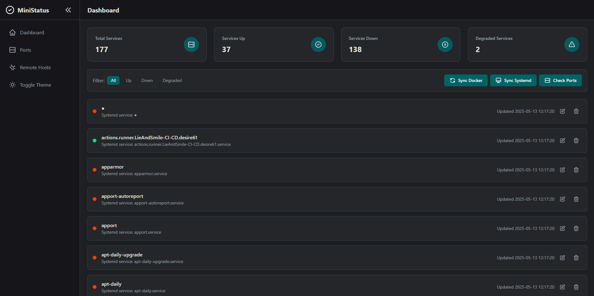
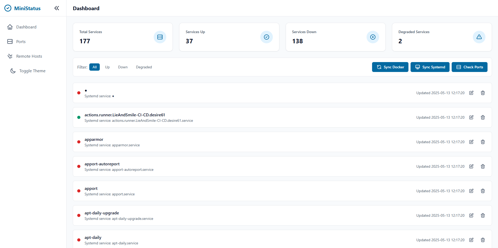

# 📡 MiniStatus

**MiniStatus** is a lightweight, self-hosted service status dashboard built for developers, homelabs, and small teams.

Version: 1.0.0

- ✅ Track service health manually or via API
- 🔍 Advanced search and filtering capabilities
- 🔐 Admin panel with password protection
- 📡 Docker & systemd sync
- 🌓 Dark/Light theme with persistent preference
- 🎯 Built with Flask + SQLite, minimal resources
- 🐳 Easy to deploy (Docker, Kubernetes, or manually)

> No Prometheus. No Grafana. Just clean uptime visibility.

<p align="center">
  
  
</p>

---

## 🚀 Getting Started

### 📦 Requirements
- Docker & Docker Compose
- Python 3.12+ (for local use)
- `.env` file with secrets

### ⚙️ Environment Setup
Create a `.env` file in the root of the project:

```env
SECRET_KEY=supersecretkey123
ADMIN_SECRET=admin123
```

Or copy the example:
```bash
cp .env.example .env
```

---

### 🐳 Docker Deployment Options

#### Quick Start (using pre-built image)
```bash
# Pull the stable version
docker pull rilmay/ministatus:1.0.0

# Create a directory for persistent data
mkdir -p instance

# Run the container
docker run -d \
  --name ministatus \
  -p 5000:5000 \
  -v $(pwd)/instance:/app/instance \
  -e SECRET_KEY=your-secret-key \
  -e ADMIN_SECRET=your-admin-secret \
  --restart unless-stopped \
  rilmay/ministatus:1.0.0
```

#### Using Docker Compose

We provide several Docker Compose configurations for different use cases:

1. **Simple Deployment** (recommended for most users)
```bash
# Using pre-built image with minimal configuration
docker-compose -f docker-compose.simple.yml up -d
```

2. **Development Mode**
```bash
# Using development configuration with live reload
docker-compose -f docker-compose.yml -f docker-compose.dev.yml up
```

3. **Production Mode**
```bash
# Using production configuration with Gunicorn
docker-compose -f docker-compose.yml -f docker-compose.prod.yml up -d
```

4. **Stop and Cleanup**
```bash
# Stop containers
docker-compose down

# Remove persistent data (optional)
sudo rm -rf instance/
```

The different configurations provide:
- `simple`: Pre-built image, minimal setup required
- `dev`: Live code reload, debugging enabled
- `prod`: Gunicorn server, optimized for production

Access the app at: [http://localhost:5000](http://localhost:5000)

---

### 🔐 Admin Panel
- Visit `/admin?auth=your-admin-password`
- Add, update, or delete services
- Sync Docker or systemd services
- Monitor local ports
- Track remote host status

---

## ⎈ Deploy to Kubernetes with Helm

### 📦 Install
```bash
helm install ministatus ./charts/ministatus
```
Customize:
```bash
helm install ministatus ./charts/ministatus \
  --set env.SECRET_KEY="yoursecret" \
  --set env.ADMIN_SECRET="youradmin"
```

### 🔁 Upgrade
```bash
helm upgrade ministatus ./charts/ministatus --set image.tag=v1.0.0
```

### 🧼 Uninstall
```bash
helm uninstall ministatus
```
Chart lives in: `charts/ministatus/`

---

## 📡 Features

| Feature                        | Status  |
|-------------------------------|----------|
| Manual service status updates | ✅ Done  |
| Docker & systemd sync         | ✅ Done  |
| `/report` API w/ key auth     | ✅ Done  |
| Admin panel (web UI)          | ✅ Done  |
| Dark/Light theme support      | ✅ Done  |
| Local port monitoring         | ✅ Done  |
| Remote host monitoring        | ✅ Done  |
| Collapsible sidebar          | ✅ Done  |
| Real-time search & filters    | ✅ Done  |
| Dynamic sorting              | ✅ Done  |

---

## 🔜 Roadmap (MiniStatus Pro)
- [ ] Telegram & Slack alerting
- [ ] Incident history & resolution notes
- [ ] Multi-project dashboard
- [ ] Role-based auth (`admin`, `viewer`)
- [ ] JSON & CSV export
- [ ] GitHub deploy webhook support
- [ ] Custom theme support
- [ ] Service grouping & tags

---

## ⭐ Support & Feedback
If you like the project, give it a ⭐ or open an issue for feedback or bugs.

> Found a bug or have a suggestion? Let us know via [Issues](https://github.com/yourproject/issues).

---

## 📄 License
MIT © [LieAndSmile](https://github.com/LieAndSmile)

