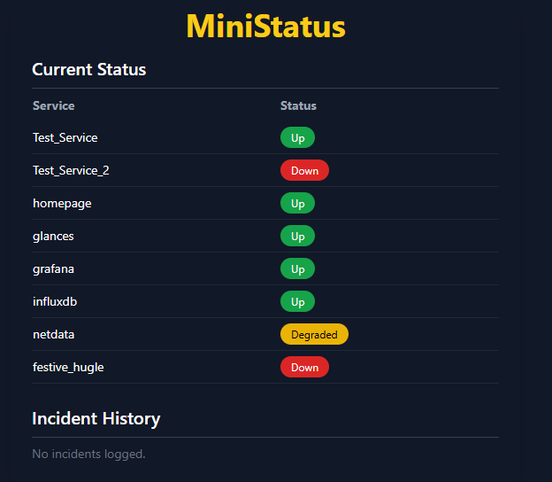

# 📡 MiniStatus

**MiniStatus** is a lightweight, self-hosted service status dashboard built for developers, homelabs, and small teams.

- ✅ Track service health manually or via API
- 🔐 Admin panel with password protection
- 📡 Docker & systemd sync
- 🎯 Built with Flask + SQLite, minimal resources
- 🐳 Easy to deploy (Docker, Kubernetes, or manually)

> No Prometheus. No Grafana. Just clean uptime visibility.



---

## 🚀 Getting Started

### 📦 Requirements
- Docker & Docker Compose
- Python 3.12+ (for local use)
- `.env` file with secrets

### ⚙️ Environment Setup
Create a `.env` file in the root of the project:

```env
SECRET_KEY=your-random-secret-key
ADMIN_SECRET=your-admin-password
```

Or copy the example:
```bash
cp .env.example .env
```

---

### 🐳 Run with Docker (Production)
```bash
docker-compose --env-file .env up --build -d
```
Access the app at: [http://localhost:5000](http://localhost:5000)

---

### 🧪 Run in Dev Mode
```bash
docker-compose -f docker-compose.dev.yml --env-file .env.dev up --build
```
Flask's dev server + volume mounts for live edits.

---

## 🔐 Admin Panel
- Visit `/admin?auth=your-admin-password`
- Add, update, or delete services
- Sync Docker or systemd services

---

## ⎈ Deploy to Kubernetes with Helm

### 📦 Install
```bash
helm install ministatus ./charts/ministatus
```
Customize:
```bash
helm install ministatus ./charts/ministatus \
  --set env.SECRET_KEY="yoursecret" \
  --set env.ADMIN_SECRET="youradmin"
```

### 🔁 Upgrade
```bash
helm upgrade ministatus ./charts/ministatus --set image.tag=v1.0.0
```

### 🧼 Uninstall
```bash
helm uninstall ministatus
```
Chart lives in: `charts/ministatus/`

---

## 📡 Features

| Feature                        | Status  |
|-------------------------------|----------|
| Manual service status updates | ✅ Done  |
| Docker & systemd sync         | ✅ Done  |
| `/report` API w/ key auth     | ✅ Done  |
| Admin panel (web UI)          | ✅ Done  |
| Telegram/Slack alerts         | ⏳ Planned |
| Public status page            | ⏳ Planned |
| Multi-project support         | ⏳ Planned |
| Incident history + notes      | ⏳ Planned |

---

## 🔜 Roadmap (MiniStatus Pro)
- [ ] Public read-only status page (`/public`)
- [ ] Telegram & Slack alerting
- [ ] Incident history & resolution notes
- [ ] Multi-project dashboard
- [ ] Role-based auth (`admin`, `viewer`)
- [ ] JSON & CSV export
- [ ] GitHub deploy webhook support

---

## ⭐ Support & Feedback
If you like the project, give it a ⭐ or open an issue for feedback or bugs.

> Want a hosted version or have feature ideas? Let us know via [Issues](https://github.com/yourproject/issues) or Discussions.

---

## 📦 Releases

**Latest:** `v1.1.0` – *May 12, 2025*  
Modularized route structure using Flask Blueprints. Cleaned up `/admin`, `/report`, and `/sync` logic.

See full [CHANGELOG.md](./CHANGELOG.md) for version history.


---

## 📄 License
MIT © [LieAndSmile](https://github.com/LieAndSmile)

